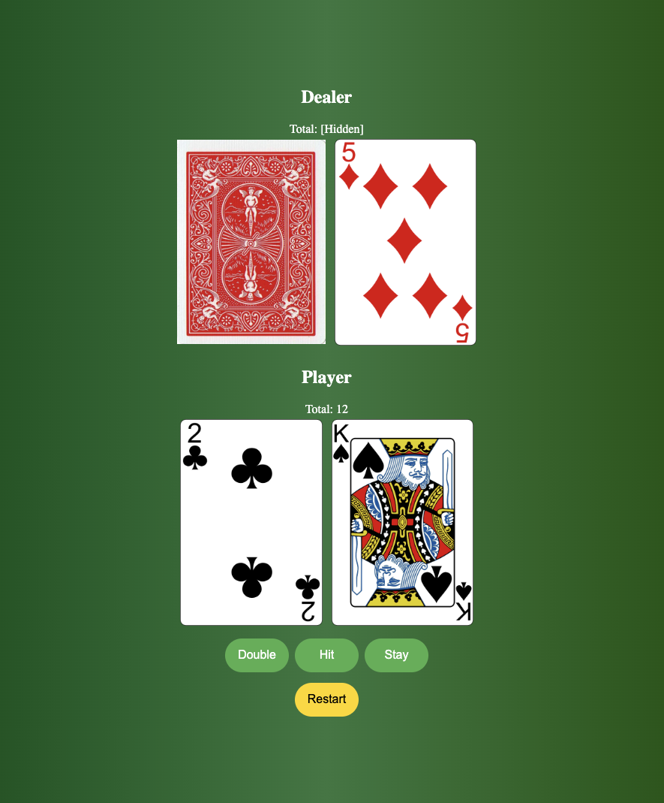

# Blackjack Game
This project is a simple implementation of the classic card game, Blackjack, also known as 21. The game is designed to be run in a web browser and offers a straightforward interface for playing against the computer dealer.

# Screenshot

# Technologies Used

- JavaScript
- HTML
- CSS
- CardStarter CSS Library

# Getting Started

https://jaxlevine.github.io/blackjack/

# Next Steps

- Adding bankroll functionality and a beting log
